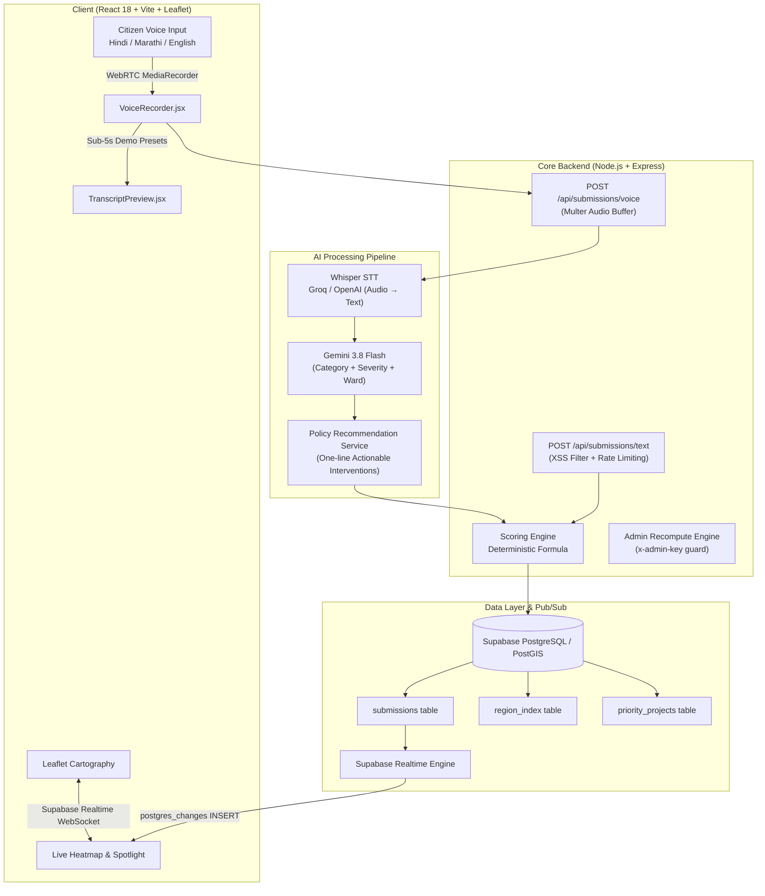

# CivicPulse — Autonomous Municipal Intelligence & Infrastructure Prioritization
> **BRICS Track 1: Digital Public Good (DPG) & Digital Public Infrastructure (DPI)**  
> *Transforming multilingual citizen grievances into an explainable, real-time ranked capital expenditure roadmap.*

---

## 1. Executive Summary & Problem Statement

Municipalities and public works departments across developing and emerging nations (notably BRICS economies) receive thousands of citizen complaints daily across fragmented channels (IVR hotlines, SMS, social apps, and in-person petitions). Public officials face three systemic bottlenecks:

1. **Information Asymmetry & Language Barriers:** Grievances arrive in regional dialects (Hindi, Marathi, Portuguese, Russian, Mandarin) with non-standard slang, making automated categorization notoriously inaccurate.
2. **"Loudest Voice" Allocation Bias:** Wealthier, technologically vocal neighborhoods bombard municipal grievance portals, while historically underserved wards with severe structural deficits remain ignored.
3. **Black-Box Skepticism:** Bureaucracies reject opaque AI recommendations that cannot provide mathematical, auditable justification for capital allocation.

**CivicPulse** is an open-source, vendor-neutral Digital Public Good that addresses all three hurdles:
- **Speech-First Ingestion:** Captures native voice in regional languages via Whisper STT and translates into structured civic intents.
- **Multimodal AI Classification:** Leverages Google Gemini 3.8 Flash to extract ward location, issue category, and severity weights in sub-second latency.
- **Auditable Priority Scoring:** Combines citizen urgency with an authentic census **Infrastructure Gap Index ($G_r$)**, ensuring equitable municipal spending.
- **Real-Time Synchronized Heatmap:** Live WebSocket updates push newly ingested grievances onto interactive cartography, triggering instant priority queue re-sorting.

---

## 2. End-to-End System Architecture



---

## 3. Mathematical Scoring Engine

CivicPulse eliminates arbitrary black-box rankings with an auditable, deterministic formula:

$$U_i = \mathrm{clamp}_{[0, 100]}\Big( 0.40 \cdot S_i + 0.35 \cdot G_r + 0.15 \cdot \min(100, V_r \cdot 10) + 0.10 \cdot R_i \Big)$$

Where:
- **$S_i \in [0, 100]$ (Severity Score):** AI-extracted hazard intensity (e.g., live sparking wire = 95, unpaved road = 65).
- **$G_r \in [0, 100]$ (Infrastructure Gap Index):** Static ward socio-economic and public works deficit (higher = historically underserved ward).
- **$V_r$ (Volume Multiplier):** Cluster density factor reflecting the number of unresolved complaints in that sector.
- **$R_i \in [0, 100]$ (Recency Decay):** Time-weighted freshness metric decaying by 5% every 24 hours ($R_i = 100 \cdot e^{-0.05 \cdot \Delta t_{\text{days}}}$).

---

## 4. Multi-Branch Git Architecture

CivicPulse was architected across 4 isolated, incrementally verified branches:

| Branch Name | Primary Scope | Verification Milestone |
|---|---|---|
| [`feature/core-backend`](file:///d:/GitHub/CivicPulse/01-core-backend.md) | Express REST API, PostgreSQL/PostGIS schemas, deterministic scoring engine, rate limiting, and security guardrails. | 14/14 engine tests + 31/31 API integration tests passing. |
| [`feature/ai-integration`](file:///d:/GitHub/CivicPulse/02-ai-integration.md) | Whisper speech-to-text, Gemini 3.8 Flash zero-shot civic classification, policy recommendation generator. | 16 test cases, 41/41 assertions passing. |
| [`feature/frontend-ui`](file:///d:/GitHub/CivicPulse/03-frontend-ui.md) | Pitch-black monochrome theme (`#000000`), CPU motherboard trace animations, custom SVG icon system, Leaflet cartography. | Zero external icon dependencies, sub-2s Vite bundle. |
| [`feature/wow-feature`](file:///d:/GitHub/CivicPulse/04-wow-feature.md) | Supabase Realtime WebSocket subscription, browser microphone voice recorder, 1-click stage demo presets, instant map spotlight flyTo. | End-to-end voice-to-map sync in under 5 seconds. |

---

## 5. Security Architecture & Digital Public Infrastructure (DPI)

CivicPulse implements comprehensive security and privacy safeguards designed for national-scale deployment:

- **Edge & Transport Defense:** Helmet-enforced HSTS, `X-Frame-Options: DENY`, `X-Content-Type-Options: nosniff`, and CORS origin whitelisting.
- **DDoS & Flooding Mitigation:** Multi-tiered rate limiters (General: 100 req/15 min; Citizen Ingestion: 15 req/15 min per IP) plus 100kb payload caps.
- **Citizen Privacy & PII Scrubbing:** All citizen contact identifiers are scrubbed; GPS coordinates are generalized to ward/sector centroid radii before public broadcast.
- **PostgreSQL Row Level Security (RLS):** Read-only anonymous access for public heatmap views; authenticated service-role writes; key-protected `/api/admin/*` recalculation routes.
- **Complete Details:** See [SECURITY.md](file:///d:/GitHub/CivicPulse/SECURITY.md) for vulnerability management and RLS SQL schemas.

---

## 6. How CivicPulse Scales Across BRICS Nations

CivicPulse was designed specifically to comply with BRICS Track 1 Digital Public Good guidelines:

1. **Dialect Agnostic:** Groq/OpenAI Whisper handles phonetic nuances across Portuguese (Brazil), Russian (Russia), Hindi/Marathi/Tamil (India), Mandarin (China), and Zulu/Xhosa/Afrikaans (South Africa).
2. **PostGIS Standard GeoJSON:** Compatible with global GIS stacks (QGIS, ArcGIS, Mapbox, open-source OpenStreetMap tiles) without proprietary lock-in.
3. **Zero-Vendor Database Lock-in:** The backend operates with Supabase PostgreSQL, self-hosted PostGIS, or lightweight in-memory storage (`localStore.js`), functioning even in intermittent connectivity environments.
4. **Transparent Governance:** Public works expenditures are prioritized via reproducible mathematics rather than opaque closed algorithms, restoring citizen trust in municipal fund distribution.

---

## 7. Quickstart & Local Installation

### Prerequisites
- Node.js v18.0+
- npm v9.0+
- Google Gemini API Key
- Supabase Project (or use the built-in zero-config fallback store)

### 1. Repository Setup
```bash
git clone https://github.com/sagarkharbikar25/CivicPulse.git
cd CivicPulse
```

### 2. Backend Configuration & Launch
```bash
cd server
npm install

# Copy environment template
cp .env.example .env
# Edit server/.env with your GEMINI_API_KEY and SUPABASE credentials

# Run all 86 unit and integration tests
npm test
node test/api.test.js
node test/aiPipeline.test.js

# Start backend server (Port 5000)
npm run dev
```

### 3. Frontend Configuration & Launch
```bash
cd ../client
npm install

# Build for production
npm run build

# Start frontend dev server (Port 5173)
npm run dev
```

Visit `http://localhost:5173` in your browser.

---

## 8. 90-Second Stage Pitch Narrative

1. **Open with the Problem (10 sec):**  
   *"Municipalities across BRICS nations receive tens of thousands of citizen complaints weekly. Officials are overwhelmed, and capital expenditure gets directed to the loudest voices rather than the most vulnerable communities."*

2. **The Live WOW Demo (30 sec):**  
   *"Watch this: a citizen in Dharavi speaks a grievance in Hindi into their phone: 'Yahan 4 din se drinking water supply band hai.' In under three seconds, Whisper transcribes the audio, Gemini classifies it as a critical water emergency, the scoring engine weights it against the local infrastructure gap, and it animates directly onto the live municipal heatmap."*

3. **The Policymaker View (20 sec):**  
   *"Switch to the Policymaker Dashboard. The city's capital expenditure priority queue has instantly re-ranked. It doesn't just show a red dot — it outputs an actionable, auditable public works intervention: 'Deploy emergency water tankers and replace corroded 400mm feeder valves within 48 hours.'"*

4. **Close on Scale & Digital Public Good (15 sec):**  
   *"CivicPulse is fully open-source, PostGIS-native, dialect-agnostic, and runs on sovereign infrastructure. It turns citizen grievances into transparent, equitable public works delivery."*

---

## 9. License

CivicPulse is distributed under the MIT License as an open-source Digital Public Good.
