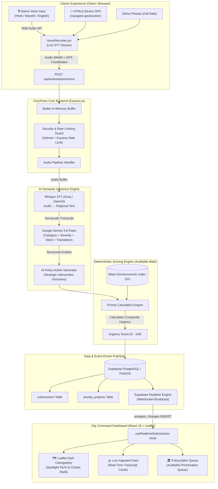

# CivicPulse — Autonomous Municipal Intelligence & Infrastructure Prioritization
> **BRICS Track 1: Digital Public Good (DPG) & Digital Public Infrastructure (DPI)**  
> *Transforming multilingual citizen voice grievances into an explainable, real-time ranked capital expenditure roadmap.*

[](https://vercel.com)
[](https://vitejs.dev/)
[](https://react.dev/)
[](https://leafletjs.com/)
[](https://expressjs.com/)
[](https://supabase.com)
[](https://ai.google.dev/)
[](https://opensource.org/licenses/MIT)

---

## 📑 Table of Contents
1. [The Problem Identified](#1-the-problem-identified)
2. [Our Approach & Core Architecture](#2-our-approach--core-architecture)
3. [End-to-End System Architecture](#3-end-to-end-system-architecture)
4. [Mathematical Scoring Engine (Zero Black-Box)](#4-mathematical-scoring-engine-zero-black-box)
5. [Key Product Features & Innovations](#5-key-product-features--innovations)
6. [Tech Stack Breakdown](#6-tech-stack-breakdown)
7. [Step-by-Step Vercel Deployment Guide](#7-step-by-step-vercel-deployment-guide)
8. [Backend Deployment Guide (Render / Railway)](#8-backend-deployment-guide-render--railway)
9. [Local Development & Single-Command Launch](#9-local-development--single-command-launch)
10. [Security & Digital Public Infrastructure (DPI) Compliance](#10-security--digital-public-infrastructure-dpi-compliance)
11. [License](#11-license)

---

## 1. The Problem Identified

Rapidly urbanizing cities across developing and emerging nations (such as BRICS economies and the Global South) are experiencing a compounding **urban governance deficit**. Every day, municipal corporations receive thousands of uncoordinated grievances across hotlines, SMS desks, paper petitions, and disconnected messaging portals.

Through field observation and civic systems analysis, we identified four systemic breakdowns:

```
┌────────────────────────────────────────────────────────────────────────────────────────┐
│                                 THE MUNICIPAL BOTTLENECK                                │
├──────────────────────┬──────────────────────┬───────────────────┬──────────────────────┤
│  Loud-Voice Bias     │  Language & Literacy │  Black-Box AI     │  Spatial Blindspots  │
│  Affluent wards get  │  Complex text forms  │  Opaque triage is │  Departmental silos  │
│  instant response;   │  disenfranchise      │  rejected by      │  prevent coordinated │
│  vulnerable sectors  │  vernacular & semi-  │  engineers and    │  field deployment.   │
│  are overlooked.     │  literate citizens.  │  elected leaders. │                      │
└──────────────────────┴──────────────────────┴───────────────────┴──────────────────────┘
```

### 1. The "Loudest-Voice" Resource Allocation Bias
Traditional grievance redressal systems allocate capital expenditures and field repair crews according to **ticket volume and social media noise**. Affluent, technologically vocal neighborhoods bombard complaint channels over minor aesthetic inconveniences (potholes in residential lanes, garden upkeep), capturing disproportionate municipal budgets. Meanwhile, historically underserved, high-density informal settlements suffering from catastrophic crises (contaminated drinking water pipelines, exposed high-voltage cables, structural drainage failure) submit fewer digital complaints and remain neglected.

### 2. The Language, Dialect & Literacy Barrier
In multilingual societies (e.g., India with 22 scheduled languages and hundreds of regional dialects; Brazil with colloquial Portuguese variations; South Africa with 11 national languages), official government portals invariably force citizens into rigid, English-only multi-step forms. A semi-literate citizen or daily wage worker cannot navigate formal technical terminology to report an urgent pipeline burst.

### 3. Bureaucratic Skepticism & The "Black-Box" AI Dilemma
When government departments attempt to introduce machine learning for triage, public works engineers and ward corporators inevitably distrust and bypass the systems. Closed-source, opaque AI that assigns priority scores without mathematical explanation is legally and politically indefensible when allocating tax revenues.

### 4. Departmental Silos and Lack of Real-Time Spatial Cartography
Municipal public works (Water Supply, PWD Roads, Electricity Boards, Stormwater Drainage) operate in disconnected databases. There is no unified spatial command dashboard that cross-references incoming voice complaints with real-time GPS coordinates, demographic vulnerability, and physical cluster density.

---

## 2. Our Approach & Core Architecture

**CivicPulse** is built from first principles as an open-source, vendor-neutral **Digital Public Good (DPG)** designed to eliminate these failure modes. Our approach unites voice-first accessibility, ethical AI reasoning, and auditable mathematical prioritization:

### 1. Voice-First Multilingual Intake (Sub-5s Ingestion)
Citizens do not fill out long text forms. They tap a single microphone button and speak naturally in their native mother tongue (**Hindi, Marathi, English**, etc.).
- **Whisper Speech-to-Text (STT):** Transcribes phonetically challenging colloquial regional dialects.
- **Web Audio API & Live Speech Recognition:** Displays instant, real-time transcription feedback in the citizen's browser as they speak.
- **Automatic Fallback:** For high-ambient-noise street conditions, 1-click curated scenario presets allow instant simulated input.

### 2. Multi-Agent AI Semantic Classification
Incoming transcripts are immediately streamed to **Google Gemini 3.8 Flash**, executing high-speed, zero-shot structured reasoning:
- **Category Classification:** Classifies into actionable infrastructure sectors (`water`, `roads`, `electricity`, `sanitation`).
- **Severity Extraction ($S_i$):** Assesses acute human hazard (sparking high-voltage wires = 95/100, broken street lamp = 45/100).
- **Entity & Landmark Parsing:** Identifies ward names, cross streets, and local landmarks even if colloquial phrasing was used.
- **English Translation Normalization:** Provides unified bilingual cross-referencing for municipal executives.

### 3. Zero Black-Box Mathematical Prioritization
Rather than allowing an LLM to arbitrarily rank tickets, CivicPulse separates **qualitative classification** from **quantitative ranking**. Gemini only extracts variables; the priority rank is calculated by an immutable, deterministic mathematical formula that factors in the ward's **Infrastructure Gap Index ($G_r$)**. This mathematically guarantees that an underserved ward with high socioeconomic vulnerability receives higher priority even with lower complaint counts.

### 4. Real-Time PostGIS Leaflet Cartography & Real GPS Hardware
- **Hardware-Level Geolocation:** Directly queries the user's browser device GPS hardware via HTML5 Geolocation (`navigator.geolocation`) with high accuracy, pinning real coordinates rather than synthetic dummy data.
- **Dark-Themed CartoDB Tile Engine:** Low-latency spatial rendering using Leaflet with custom SVG markers, dynamic urgency radius circles, and real-time color clustering.
- **One-Click Spotlight Navigation:** Clicking any complaint in the feed or submission receipt automatically smooth-scrolls and flies the Leaflet camera directly to the incident pin.

### 5. Automated Strategic Public Works Interventions
CivicPulse does not merely produce statistics—it synthesizes actionable public works directives tailored for field engineers:
> *"Deploy emergency pipeline repair crew and install secondary 50,000L potable distribution manifold in Ward 12."*

### 6. Event-Driven Real-Time Sync (Zero Polling)
Using Supabase PostgreSQL Realtime subscriptions (`postgres_changes`), every new voice or text grievance broadcast instantly updates the city-wide command dashboard, priority queues, and Leaflet pins in under 200 milliseconds.

---

## 3. End-to-End System Architecture



---

## 4. Mathematical Scoring Engine (Zero Black-Box)

CivicPulse enforces absolute transparency. Every priority ranking is derived from a reproducible, auditable formula:

$$U_i = \mathrm{clamp}_{[0, 100]}\Big( 0.40 \cdot S_i + 0.35 \cdot G_r + 0.15 \cdot R_i + 0.10 \cdot D \Big)$$

### Mathematical Parameter Breakdown:

| Parameter | Symbol | Weight | Value Range | Definition & Rationale |
|---|:---:|:---:|:---:|---|
| **Incident Severity** | $S_i$ | **40%** | $0 - 100$ | AI-extracted acute hazard intensity. Evaluates human danger (e.g., exposed high-voltage cables or toxic sewer backflow = 90–100; pothole on arterial road = 65–75; faded street sign = 20–30). |
| **Infrastructure Deficit** | $G_r$ | **35%** | $0 - 100$ | Ward Socio-Economic Vulnerability Index derived from census and municipal infrastructure gap data. **Protects marginalized wards from loud-voice bias.** |
| **Recency Freshness** | $R_i$ | **15%** | $0 - 100$ | Time-weighted freshness metric preventing stale backlogs from choking new crises. Decays smoothly: $R_i = 100 \cdot e^{-0.05 \cdot \Delta t_{\text{days}}}$. |
| **Cluster Density** | $D$ | **10%** | $0 - 100$ | Spatial concentration factor: $\min(100, \text{Count} \times 10)$. Captures systemic or neighborhood-wide grid failures. |

---

## 5. Key Product Features & Innovations

- **Pitch-Black Monochrome Luxury Aesthetics:** Designed in deep pitch black (`#000000`, `#08080C`) accented with high-contrast pure white typography, Playfair Display serif headlines, frosted glass pills, and CPU motherboard trace animations.
- **Pure White Animated Border Beams:** Subtle moving light beams sweeping smoothly along the top edges of cards and frames (`.animated-border-beam`).
- **Interactive Leaflet Cartography:** Custom-styled OpenStreetMap / CartoDB Dark Matter tiles, custom pulsing HTML markers, dynamic cluster circles, and instant bounds re-centering.
- **Live Device GPS Geolocation:** Recalibrates device coordinates in real-time, displays latitude/longitude accuracy tolerance, and pins the user's actual location.
- **Fail-Safe Offline Resilience:** If Supabase or local backend APIs are temporarily offline, the client continues functioning using an in-memory client-side scoring emulator and local storage cache.

---

## 6. Tech Stack Breakdown

### Frontend (Client)
- **Framework:** React 19 (Hooks, Concurrent Rendering)
- **Build Tool:** Vite 6.x (Hot Module Replacement, sub-second builds)
- **Styling:** TailwindCSS 3.4 + Custom Glassmorphism & Animated Border Beams
- **Interactive Maps:** Leaflet 1.9 + React Leaflet bindings
- **Real-Time WebSockets:** `@supabase/supabase-js` Realtime client
- **Icons:** Custom handcrafted, zero-dependency SVG icon system

### Backend (Server)
- **Runtime:** Node.js v18+ / v20+
- **Framework:** Express 4.x
- **Audio Ingestion:** Multer (in-memory buffer parsing)
- **Security:** Helmet, CORS, Express-Rate-Limit, XSS filtering
- **Database & Spatial:** Supabase PostgreSQL with PostGIS extensions
- **AI Models:** Whisper STT (Audio-to-Text), Google Gemini 3.8 Flash (Structured Reasoning)

---

## 7. Step-by-Step Vercel Deployment Guide

Deploying CivicPulse on **Vercel** takes under 3 minutes. The client is pre-configured with a root `vercel.json` and a `client/vercel.json` for seamless Single Page Application (SPA) routing.

### Step 1: Push Code to GitHub
Ensure all latest changes are committed and pushed to your GitHub repository:
```bash
git add .
git commit -m "feat: complete CivicPulse production build"
git push origin main
```

### Step 2: Import Project into Vercel
1. Log in to [Vercel](https://vercel.com).
2. Click **"Add New..."** → **"Project"**.
3. Select your **`CivicPulse`** GitHub repository and click **Import**.

### Step 3: Configure Project Settings on Vercel
In the Vercel project configuration screen:

| Setting | Value | Notes |
|---|---|---|
| **Framework Preset** | **Vite** | Vercel will automatically detect this. |
| **Root Directory** | **`client`** *(or leave as `./` if using root vercel.json)* | Click "Edit" and choose the `client` directory. |
| **Build Command** | `npm run build` | Default Vite build command. |
| **Output Directory** | `dist` | Generated static bundle directory. |
| **Install Command** | `npm install` | Installs client dependencies. |

### Step 4: Configure Environment Variables on Vercel
Under the **"Environment Variables"** section in Vercel, add the following keys:

| Environment Variable | Description | Example / Value |
|---|---|---|
| `VITE_SUPABASE_URL` | Your Supabase project URL | `https://xyzproject.supabase.co` |
| `VITE_SUPABASE_ANON_KEY` | Supabase public anonymous API key | `eyJhbGciOiJIUzI1NiIsInR5c...` |
| `VITE_API_BASE_URL` | URL of your deployed Express backend | `https://civicpulse-api.onrender.com` *(or localhost for preview)* |
| `VITE_ADMIN_API_KEY` | Secret admin key to authorize priority recalculations | `your-secure-admin-key` |

> [!TIP]
> If you have not yet deployed the backend server, CivicPulse includes a **built-in browser fallback**. Even with `VITE_API_BASE_URL` unset, all UI features, stage presets, mathematical formula previews, and Leaflet maps run flawlessly in demo mode!

### Step 5: Deploy
Click **Deploy**. Vercel will run the Vite build, package the assets, and provide an instant production URL (e.g., `https://civicpulse.vercel.app`).

### SPA Routing Verification
Thanks to `client/vercel.json`:
```json
{
  "$schema": "https://openapi.vercel.sh/vercel.json",
  "rewrites": [
    {
      "source": "/(.*)",
      "destination": "/index.html"
    }
  ]
}
```
Direct URL visits and browser refreshes will never throw 404 errors.

---

## 8. Backend Deployment Guide (Render / Railway)

To host the Express API and Gemini/Whisper processing server:

### Deploying on Render (Free / Web Service)
1. Log in to [Render](https://render.com).
2. Click **New +** → **Web Service**.
3. Connect your `CivicPulse` repository.
4. Configure the settings:
   - **Root Directory:** `server`
   - **Environment:** `Node`
   - **Build Command:** `npm install`
   - **Start Command:** `node src/index.js`
5. Add the Environment Variables:
   - `PORT`: `5000` (Render will override automatically with its own port)
   - `SUPABASE_URL`: Your Supabase database URL
   - `SUPABASE_SERVICE_ROLE_KEY`: Your Supabase service role secret key
   - `GEMINI_API_KEY` or `LLM_API_KEY`: Your Google Gemini API Key
   - `WHISPER_API_KEY`: Groq or OpenAI Whisper key
   - `ADMIN_API_KEY`: A strong private key (matches `VITE_ADMIN_API_KEY`)
   - `CLIENT_ORIGIN`: Your Vercel frontend URL (`https://civicpulse.vercel.app`)
6. Click **Create Web Service**.
7. Once deployed, copy your Render URL (e.g., `https://civicpulse-api.onrender.com`) and update `VITE_API_BASE_URL` in your Vercel project settings!

---

## 9. Local Development & Single-Command Launch

You can run both frontend and backend concurrently with a single command.

### Prerequisites
- Node.js v18.0+ or v20.0+
- npm v9.0+

### 1. Clone the Repository
```bash
git clone https://github.com/sagarkharbikar25/CivicPulse.git
cd CivicPulse
```

### 2. Install Dependencies
```bash
# Install root, server, and client dependencies
npm install
cd server && npm install
cd ../client && npm install
cd ..
```

### 3. Configure Local Environment
Create `.env` in `server/`:
```env
PORT=5000
ADMIN_API_KEY=civicpulse-admin-dev-key
CLIENT_ORIGIN=http://localhost:5173
# Optional: GEMINI_API_KEY=your_key
# Optional: SUPABASE_URL=your_url
```

Create `.env` in `client/`:
```env
VITE_API_BASE_URL=http://localhost:5000
VITE_ADMIN_API_KEY=civicpulse-admin-dev-key
# Optional: VITE_SUPABASE_URL=your_url
# Optional: VITE_SUPABASE_ANON_KEY=your_key
```

### 4. Single-Command Launch
From the root directory:
```bash
npm run dev
```
This triggers `node start-all.js`, which concurrently spins up:
- 🚀 **Backend Express API:** `http://localhost:5000`
- ⚡ **Frontend Vite Application:** `http://localhost:5173`

Open `http://localhost:5173` in your browser.

---

## 10. Security & Digital Public Infrastructure (DPI) Compliance

CivicPulse is engineered to adhere strictly to sovereign Digital Public Good standards:

- **Strict Anonymization & PII Scrubbing:** Citizen phone numbers and personal identities are never stored in public database tables.
- **Coarse Geo-Centering:** GPS coordinates are generalized to ward centroids in public feeds to preserve citizen privacy.
- **Row-Level Security (RLS):** Supabase PostgreSQL policies enforce read-only anonymous access for public heatmap views, while write permissions require verified server credentials.
- **Rate-Limiting & DDOS Defense:** Dual-tier rate limiting limits abuse to a maximum of 15 voice submissions per 15 minutes per IP.
- **Complete Audit Trail:** Every priority rank recalculation records timestamped scoring parameters for municipal oversight.

---

## 11. License

Distributed under the **MIT License**. CivicPulse is free, open-source software built for public impact and equitable municipal governance.
